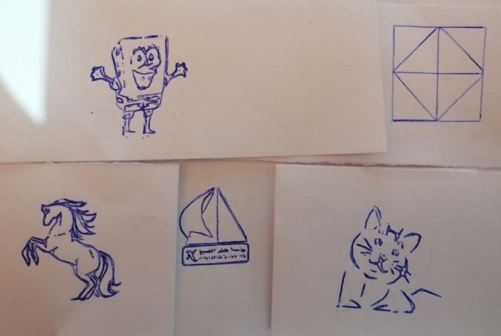

# CNC Plotter Machine

Using Arduino Uno and a few resources, we have designed a CNC Plotter Machine that has the ability to draw with a pen via G-Code. This machine can draw with dimensions of 4 * 4 cm, and you can design a drawing machine with larger dimensions than these by enlarging the size of the x axis and y axis according to your requirements.

## Table of Contents

- [Installation](#installation)
- [Usage](#usage)
- [Features](#features)
- [Documentation](#documentation)
- [Acknowledgments](#acknowledgments)
- [Contributing](#contributing)
- [License](#license)
- [FAQ](#faq)
- [Contact](#contact)

## Installation

To get started with the CNC plotter machine, follow these steps:

1. Assemble the hardware components according to this [video](https://youtu.be/Gm6bH3p6cNQ).

- Components
	- 1 * Arduino Uno
	- 1 * Motor Driver L293D Shield
	- 1 * Mini Servo Motor
	- 2 * CD-ROMs

2. Connect the CD-ROM stepper motors to the motor driver, and then connect the motor driver to the Arduino Uno.
3. Download and install [Arduino IDE](https://www.arduino.cc/en/software), [Inkscape 0.91](https://inkscape.org/release/inkscape-0.91/?latest=1) and [Processing](https://processing.org/download).
4. Install the [AFMotor](AFMotor.rar) Library, you can install it manually by downloading the files and install it into Arduino IDE or directly from library manager.
5. Clone or Download the repository to your local machine using the following command:
```
git clone https://github.com/kershrita/CNC-Plotter-Machine.git
```

## Usage

Once the CNC plotter machine is set up and connected, you are ready to use it:

1. Adjust the pen holder to securely hold the pen or marker.
2. Place a sheet of paper or a drawing surface on the flat surface where you want the plotter to draw.
3. Power on the Arduino Uno and initiate communication with the plotter machine.
4. Making gcode from images with Inkscape 0.91.There is ready gcode to test if you want.
5. Open Processing IDE then open this [scetch](processing%20code/GCTRL.pde].
6. Run the code, there is a window will appear choose Arduino board port then upload the gcode to the board.
7. Output, [our machine while drawing](https://drive.google.com/file/d/1T6XbWHDwXpsRdm7keNW0uuRVcscyL0hK/view).



## Features

- **Versatile Drawing Capability**: The CNC plotter machine can draw various patterns, shapes, and text based on the provided input.
- **Precise Movement Control**: The machine uses stepper motors to precisely control the positioning of the pen, ensuring accurate drawing.
- **Easy Control Interface**: The Arduino Uno serves as the control unit, allowing you to send commands to the plotter machine.
- **Customizable Pen Holder**: The plotter machine includes a pen holder that can be adjusted to accommodate different pen sizes and types.
- **Compact and Portable**: The use of an Arduino Uno and a CD-ROM drive makes the CNC plotter machine compact and portable.

## Documentation

If you get stucked with any step, you can give a look for the original article **[here](https://electricdiylab.com/how-to-make-arduino-mini-cnc-plotter-machine/)**.

## Acknowledgments

We would like to acknowledge the following resources and libraries that have been instrumental in developing CNC Plotter Machine:

- **[Arduino IDE](https://www.arduino.cc/en/software)**:  An open-source integrated development environment (IDE) used for programming Arduino boards.
- **[Inkscape 0.91](https://inkscape.org/release/inkscape-0.91/?latest=1)**:  An open-source vector graphics editor used for creating and editing graphical assets.
- **[Processing](https://processing.org/download)**: An open-source software sketchbook and development environment for creating interactive art, animations, and applications.

## Contributing

Thank you for considering contributing to the Kids Learning Program! We welcome any contributions that can enhance the program and make it even better for kids.

## License

Kids Learning Program is released under the [MIT License](LICENSE).

## Contact

- Mail: ashrafabdulkhaliq80@gmail.com
- LinkedIn: https://www.linkedin.com/in/ashraf-abdulkhaliq
- GitHub: https://github.com/kershrita