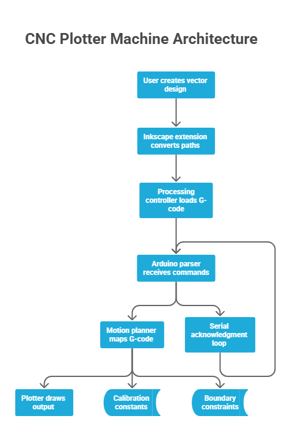
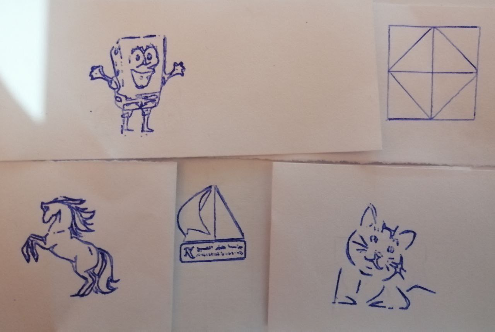

# CNC Plotter Machine

> End-to-end intelligent plotting pipeline that converts vector artwork into motion commands and executes them on a low-cost 2-axis CNC pen plotter.

## Overview

This project is a full stack cyber-physical system that combines geometry processing, command streaming, and embedded motion control to produce accurate pen plots from digital designs.

Instead of focusing only on firmware, the repository captures the complete runtime pipeline:

- Design-to-G-code conversion via an Inkscape extension.
- Host-side orchestration and serial streaming through a Processing control application.
- Real-time command interpretation and actuation on Arduino firmware.

Real-world use cases:

- Low-cost prototyping for education, robotics labs, and rapid visual testing.
- Signature, logo, and shape plotting for maker workflows.
- Baseline platform for intelligent path planning and vision-assisted calibration research.

## Architecture

Core components:

1. Input and Planning Layer
- Inkscape extension parses vector paths and converts them into plotter-compatible G-code.
- Sample jobs in gcode tests provide repeatable validation inputs.

2. Host Control Layer
- Processing app manages serial connectivity, manual jog commands, and file-based G-code streaming.
- Streaming flow is stateful and command-driven, reducing accidental mixed-mode control.

3. Embedded Execution Layer
- Arduino firmware interprets movement and pen commands.
- AFMotor-based stepper control and servo pen-up/pen-down logic execute the trajectory.
- Workspace boundaries and motion constants define safe plotting limits.

4. Physical Actuation Layer
- Dual CD-ROM stepper axes provide X/Y movement.
- Servo channel controls pen contact state.

### Architecture Diagram



## Features

- End-to-end pipeline from vector art to physical plot.
- Offline G-code testing with reusable sample drawings.
- Manual jog and homing controls in the host UI.
- Deterministic pen state control using M300 command mapping.
- Configurable step-per-millimeter calibration for machine tuning.
- Compact hardware profile based on widely available components.

## Technical Highlights

- System design over isolated scripts: each layer has a clear responsibility and interface.
- Safety-oriented constraints: firmware-level min/max bounds reduce out-of-range motion.
- Streaming architecture: host and firmware separation enables easier debugging and extension.
- Embedded parsing strategy: line-buffered command handling supports long G-code jobs.
- Extensibility path: architecture can be upgraded with trajectory smoothing, adaptive speed control, or perception-based correction.

## Tech Stack

- Embedded: Arduino Uno, C/C++, Servo library, AFMotor.
- Host control: Processing (Java mode), processing.serial.
- Geometry and conversion: Inkscape extension (Python), SVG parsing utilities.
- Hardware: L293D motor shield, 2x CD-ROM stepper assemblies, mini servo.
- Job assets: curated G-code test set for repeatable functional checks.

## Getting Started

### 1. Hardware Assembly

- Assemble the X/Y frame using two CD-ROM linear mechanisms.
- Connect motors through L293D shield to Arduino Uno.
- Mount and wire servo for pen lift.

Reference build video: https://youtu.be/Gm6bH3p6cNQ

### 2. Software Setup

Install:

- Arduino IDE
- Processing IDE
- Inkscape 0.91 or a compatible version for the included extension

Install dependencies:

- AFMotor library from [AFMotor.rar](AFMotor.rar)

Clone repository:

```bash
git clone https://github.com/kershrita/CNC-Plotter-Machine.git
cd CNC-Plotter-Machine
```

### 3. Flash Firmware

- Open arduino code/arduino code.ino in Arduino IDE.
- Select board and serial port.
- Upload firmware to Arduino Uno.

### 4. Run Host Controller

- Open processing code/GCTRL/GCTRL.pde in Processing.
- Run the sketch and select the correct serial port using p.
- Press g to load a G-code file from gcode tests.
- Stream commands and monitor drawing execution.

## Results

Observed outcomes from the current implementation:

- Successful pen plotting on a 40 mm x 40 mm workspace envelope (configurable in firmware).
- Reproducible execution of multiple test jobs from gcode tests.
- Stable command-to-actuation behavior for core commands (G1, G4, M300).

Artifacts:

- Demonstration video: [Watch the CNC plotter demo](https://drive.google.com/file/d/1T6XbWHDwXpsRdm7keNW0uuRVcscyL0hK/view)
- Sample machine output:



## License

Released under the [MIT License](LICENSE).